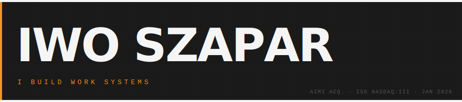
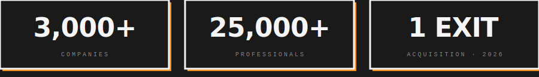

<br>

Co-founded the **AI Maturity Index** with Harvard researchers — validated on 420,000 data points, [acquired by ISG (Nasdaq: III)](https://isg-one.com) in January 2026. Now shipping **Second Brain**: an AI-powered productivity system for knowledge workers, fully automated from purchase to delivery.

Microsoft · Walmart · governments worldwide.


## Featured

<a href="https://github.com/iwo-szapar/second-brain-health-check">
  
</a>


## Current Work

```
→ Second Brain          AI productivity system for knowledge workers
→ Context Engineering   Systematic approach to working with AI agents
→ This entire site      Shipped with Claude Code + 60+ custom skills
```


## Recent Writing

| | |
|:--|:--|
| [Context Engineering Research: What I Found After You Shared That Paper](https://iwoszapar.com/p/agents-md-do-context-files-help) | Feb 2026 |
| [20 Papers on Context Engineering. Only One Tested What Actually Matters.](https://iwoszapar.com/p/context-engineering-research-2026) | Feb 2026 |
| [How We're Building a Company Second Brain for 10 People Using Claude Code Agent Teams](https://iwoszapar.com/p/company-second-brain-ai-agent-teams) | Feb 2026 |
| [AI Hyperproductivity: The ADHD Superpower Stack](https://iwoszapar.com/p/ai-hyperproductivity-adhd-superpower) | Feb 2026 |

→ [All writing at iwoszapar.com](https://iwoszapar.com)


## Stack


<p>
<a href="https://linkedin.com/in/iwo-szapar"></a>&nbsp;
<a href="https://iwoszapar.com"></a>&nbsp;
<a href="https://iwoszapar.com/second-brain-ai"></a>
</p>
