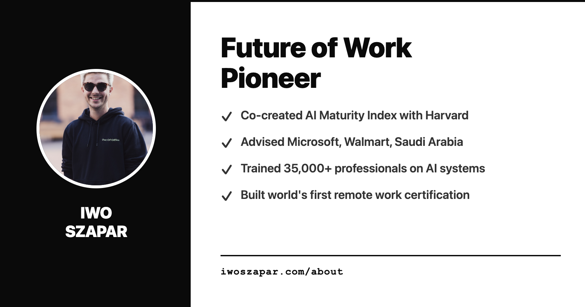
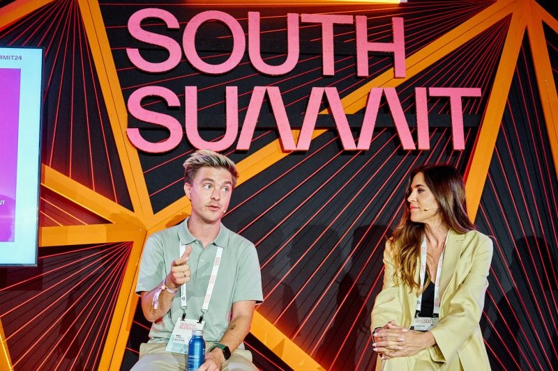

  

 

<table>
<tr>
<td width="220" valign="top">

</td>
<td valign="top" style="padding-left: 24px">

**Iwo Szapar** — builder, writer, slowmad. Born in Gdańsk, Poland. Lived in 15 countries.

Co-founded the **AI Maturity Index** with Harvard researchers — 7,000+ assessments, 420,000+ data points, [acquired by ISG (Nasdaq: III)](https://markets.ft.com/data/announce/detail?dockey=600-202601140900BIZWIRE_USPRX____20260114_BW051216-1) in January 2026. Before that, built the world's first remote work certification platform. Trained 25,000+ professionals from Netflix, GitHub, and HubSpot.

Now building **Second Brain**: AI-powered productivity for knowledge workers. The entire `iwoszapar.com` is built and shipped using Claude Code + 60+ custom skills.

Microsoft · Walmart · Saudi Ministry of Communications · governments worldwide.

</td>
</tr>
</table>

---

## Current Projects

**01 — AI Maturity Index** `Acquired by ISG 2026`
Co-founded with Harvard researchers. 7,000+ assessments across 75 countries, 400,000+ data points. Acquired by ISG (Nasdaq: III) as part of their AI acceleration strategy.

**02 — Second Brain AI**
Repository-backed AI workflow system. Consultants, PMs, and operators ship briefs in 90 minutes instead of 15+ hours. Built on GitHub + Claude Code with persistent memory and evidence-gated workflows.

**03 — Context Engineering**
Systematic approach to AI agent infrastructure. This repo is the proof of concept.

---

## Recent Writing

| | |
|:--|:--|
| [Context Engineering Research: What I Found After You Shared That Paper](https://iwoszapar.com/p/agents-md-do-context-files-help) | Feb 2026 |
| [20 Papers on Context Engineering. Only One Tested What Actually Matters.](https://iwoszapar.com/p/context-engineering-research-2026) | Feb 2026 |
| [How We're Building a Company Second Brain Using Claude Code Agent Teams](https://iwoszapar.com/p/company-second-brain-ai-agent-teams) | Feb 2026 |
| [AI Hyperproductivity: The ADHD Superpower Stack](https://iwoszapar.com/p/ai-hyperproductivity-adhd-superpower) | Feb 2026 |

→ **[All writing at iwoszapar.com](https://iwoszapar.com)**

---

## Featured In

`Financial Times` &nbsp; `Forbes` &nbsp; `ISG` &nbsp; `SDAIA` &nbsp; `South Summit` &nbsp; `Microsoft` &nbsp; `FlexOS`

---

## Speaking

 &nbsp; 

---

## Stack

---

